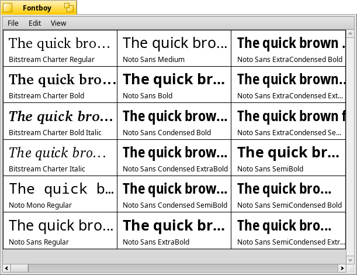

Fontboy
=======

© 1999-2003 Oliver 'Madison' Kohl

Introduction
============
Fontboy is a small application to show your installed fonts in Haiku. You can get additional information of the selected font and a preview of the complete Unicode charset. Fontboy allows you to adjust the appearance to your desired needs, and it's fast because Haiku is.

Features
========
- Watches all your installed fonts
- Browse the complete Unicode character set of a font
- Magnified view of single characters
- Drag & drop support
- Tooltips
- Highly customizeable

How to use Fontboy
==================
In the main window, all installed fonts will be displayed with some sample text, their name, and the style. Single-click to select a font. Double-click to open the details window and get more information about a font. A right-click will show a menu where you can also open the details window or refresh the font list after installing new fonts.

The details window shows you further information about the selected font and a graphical view of its Unicode character set. The selected character in the matrix will be shown in a bigger view on the left side. Use the mouse or cursor keys to change the selection. Use upper right navigation buttons or PageUp/PageDown keys to change page. You can also drag & drop special characters to paste into inputs.

Preferences
===========
To change the application settings, go to Edit > Settings.

Here, you can change:
- The font size used
- How many columns appear
- The example text for samples
- How the samples appear

Tips
====
- Dragging & dropping a font file onto the main window sends an FFont object, but there are not a lot of applications that support it.

Contact
=======
- Web: [fontboy.sourceforge.net](http://fontboy.sourceforge.net)
- Email: [fontboyapp@gmail.com](mailto:fontboyapp@gmail.com)
- Twitter: [@fontboy](https://twitter.com/fontboy)

Credits
=======
Splashscreen image by Thomas 'tHOM!' Einweg  
Coding & additional graphics by Oliver 'Madison' Kohl

Thanks and regards must go to:
- Dianne Hackborn (and others) for the FFont
- Marco Nelissen for his BubbleHelper class
- Eric Shepherd for his TPreferences class
- YNOP Talton for SplitPane class
